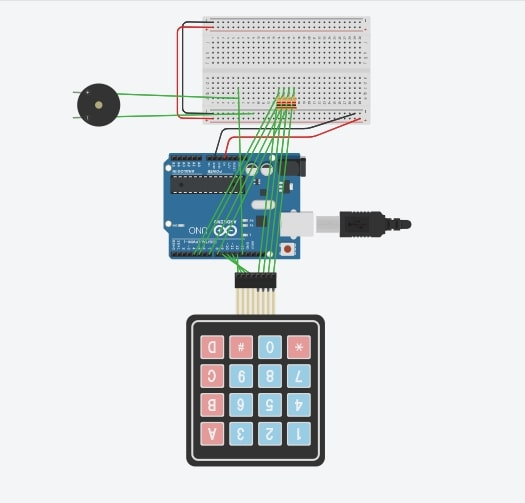

# Password checker with acoustic confirmation
### This project aims to detect a correct security code.

##### Functional description
If it is entered from the circuit keyboard correctly, a song will start playing with the help of the buzzer used at different frequencies (Take on me).

Each key pressed on the keyboard will be displayed in the Arduino console so that the user can see the correct code. This is established from the code (1337).

##### Schematic

##### Sample Results
<iframe width="560" height="315" src="https://www.youtube.com/embed/ABaDcrCu7e8" frameborder="0" allowfullscreen></iframe>
